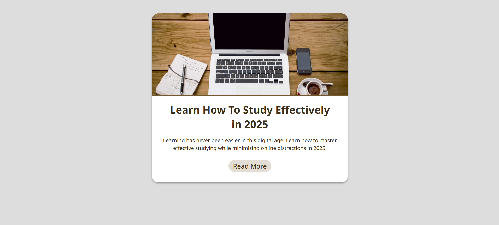

# 💻 Blog Post Card

## ℹ️ A Simple Card Component Web Page

This project features a clean and modern blog post card UI component. It showcases a promotional blog preview using a card layout with styled typography, borders, and responsive design techniques.

It was built entirely with HTML and CSS as part of the [**freeCodeCamp.org**](https://www.freecodecamp.org/learn/full-stack-developer/) CSS course.

---

## 🔍 Overview

The **Blog Post Card** is a static UI component designed to preview a blog article. It contains an image, a headline, a short excerpt, and a "Read More" button linking to an external resource.

The design uses a minimalist layout with clearly defined sections, soft color tones, and rounded edges to convey a clean and approachable reading experience.

---

## ✨ Features

- Clean, centered card layout
- Responsive design using flexible widths and `max-width`
- Styled HTML `time` element for semantic clarity
- Smooth hover effects for interactive links
- Google Fonts integration for modern typography
- Color palette optimized for contrast and readability
- Card shadow and border radius for visual depth

---

## 🧠 What I Learned

- How to design and center a standalone card component
- Best practices for semantic HTML elements like `<time>` and `<section>`
- Responsive spacing with `clamp()` for font and margin sizes
- Smooth hover transitions using `transform` and `scale`
- How to use CSS custom properties (`--variables`) to improve maintainability
- Basic accessibility features like readable contrast and keyboard-friendly links

---

## 🛠️ Tech Used

- HTML5
- CSS3
- Git
- GitHub
- Netlify

---

## 🚀 How to Run

1. Clone the repository
2. Open `index.html` in your browser

---

## 🌐 Live Demo

Or you can check out the 👉 [live website here](https://blog-post-card-fcc-jiro.netlify.app/)

---

## 🧑‍💻 Author

Created by **Elmar Chavez**

🗓️ Month/Year: **May 2025**

📚 Journey: **2nd** month of learning _frontend web development_.
